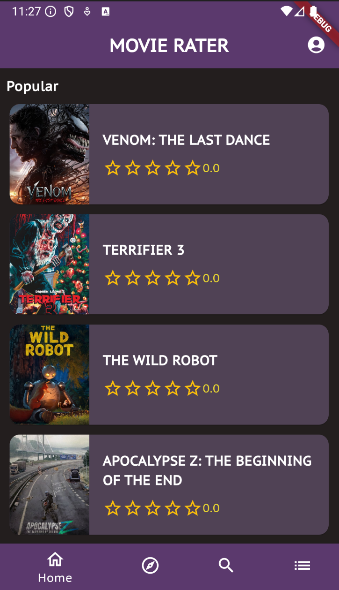

# IDATA2503 Project G04

Project in course
[IDATA2503 Mobile applications](https://www.ntnu.edu/studies/courses/IDATA2503#tab=omEmnet) at
[NTNU](https://www.ntnu.edu/). The project is done by group 4.

## Table of Contents

1. [Introduction](#movie-rating-app)
2. [Features](#features)
3. [Demo](#demo)
4. [Installation](#installation)
5. [Project Structure](#project-structure)
6. [Troubleshooting](#troubleshooting)
7. [License](#license)


## Movie Rating App

A Flutter/Dart application to rate movies. This app lets you explore different movies and see
their details. Find a movie you like and add it to your watchlist. Done watching? Move the movie to
a completed list and give it a review.

The application uses the API provided by [TMBD](https://www.themoviedb.org/) as the source of data
and images. See the [TMBD API](https://developer.themoviedb.org/docs/getting-started) documentation
for more information.

## Features

- Browse and explore movies
- View detailed movie information
- Add movies to your watchlist
- Rate and review movies
- Search for movies by title or genre

## Demo

### Home Screen


## Installation

### Prerequisites:
- Flutter SDK installed ([Installation Guide](https://flutter.dev/docs/get-started/install))
- Dart SDK installed (comes with Flutter)

### Steps:

1. Clone the github repository:

```bash
  git clone https://github.com/matsbak idata2503-project-g04.git
  cd idata2503-project-g04
```
2. Install dependencies:
```bash
  flutter pub get
```
3. Set up your emulator or connect a device.
  - Android: Set up an Android Virtual Device (AVD)
  - iOS: Open Xcode and set up an iOS Simulator (macOS only)
4. Run the app:
```bash
  flutter run
```


## Project structure

The app's main components are organized as follows:

```
IDATA2503-Project-g04/
├── lib/
│   ├── forms/
│   │   └── forms...
│   ├── models/
│   │   ├── movie.dart
│   │   └── rating.dart
│   ├── providers/
│   │   └── providers...
│   ├── screens/
│   │   ├── tabs
│   │   ├── explore
│   │   ├── search
│   │   ├── profile
│   │   └── movie_details
│   ├── service/
│   │   └── firebase_service
│   ├── widget/
│   │   └── widgets...
│   └── main.dart
├── ...
└── ...
```
- <b>lib/forms</b> contains form logic for log in/out, as well as authentication with users.

- <b>lib/models</b> contains the data classes or objects inside the app. These classes represents
the data, e.g. the movies or reviews.

- <b>lib/providers</b> contains provider logic to handle cross class data. Used so data is up to date everywhere in the project.

- <b>lib/screens</b> contains the different screens the user can navigate inside the app.

- <b>lib/service</b> contains service classes to seperate logic from the project so it can be reused. e.g. firebase methods for sending http requests.

- <b>lib/widgets</b> contains all the different widgets used. These widgets are either large
widgets or reused in different areas inside the app.

## Troubleshooting
If the project fails to build, ensure all dependencies are installed using:
```bash
  flutter doctor
```
Restart the IDE if issues persist.